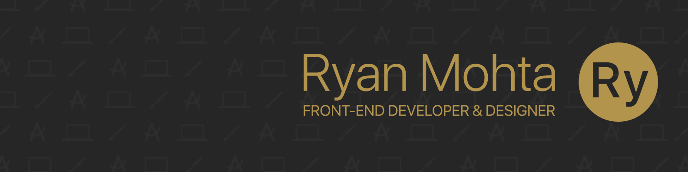

### Hey there! I'm Ryan, a Front-End Developer and 2nd-year CS Student @ UC Irvine.

I love both computer science and design, and am interested in areas where these passions intersect, such as front-end web/app development and UI/UX design! I'm a strong believer in making products as elegant and intuitive as they are functional, and you'll see this philosophy appear in every product I've developed.

#### Some projects I've worked on
🌙 &nbsp;**[Messenger Black](https://messengerblack.com):** Dark Mode for Facebook Messenger on Safari/Chrome that can optionally be aligned with the sun's natural rhythm. _(completed at the end of my senior year of high school; 40,000+ downloads across Safari and Chrome)_

🧵 &nbsp;**[Tapestry](https://devpost.com/software/tapestry):** Code Visualization for Python that supports diagram generation for objects, lists, and classes. _(currently under development; Best Entrepreneurial Hack @ HackUCI 2020)_

🐜 &nbsp;**PeterPortal:** A fully-integrated course scheduling and planning website that will serve all UCI students. _(currently under development alongside the UCI ICS Student Council Projects Committee)_

🏆 &nbsp;**Sticking To Your Goal:** A cross-platform mobile app allowing users to create custom Snapchat/Instagram story stickers featuring steps taken, heart rate, and ohter personal data. _(currently under development alongside Professor Daniel Epstein's undergraduate research team)_

#### What else do I do?
📸 &nbsp;I LOVE photography, and have been doing it for many years! My favorite photos to take are portraits and nature. 
🏃🏽‍♂️ &nbsp;I really enjoy running, and was part of my middle and high school track and field team as a distance runner. 
🌘 &nbsp;I'm a huge dark mode enthusiast, a big reason why I decided to base my first published project (Messenger Black) around it!

#### Let's get in touch! Find me on [LinkedIn][linkedin], view my [resume][resume], or send me an [email][email].
[linkedin]: https://www.linkedin.com/in/ryanmohta/
[resume]: https://ryanmohta.com/resume.pdf
[email]: mailto:mohtar@uci.edu

<!--
**ryanmohta/ryanmohta** is a ✨ _special_ ✨ repository because its `README.md` (this file) appears on your GitHub profile.

Here are some ideas to get you started:

- 🔭 I’m currently working on ...
- 🌱 I’m currently learning ...
- 👯 I’m looking to collaborate on ...
- 🤔 I’m looking for help with ...
- 💬 Ask me about ...
- 📫 How to reach me: ...
- 😄 Pronouns: ...
- ⚡ Fun fact: ...
-->
